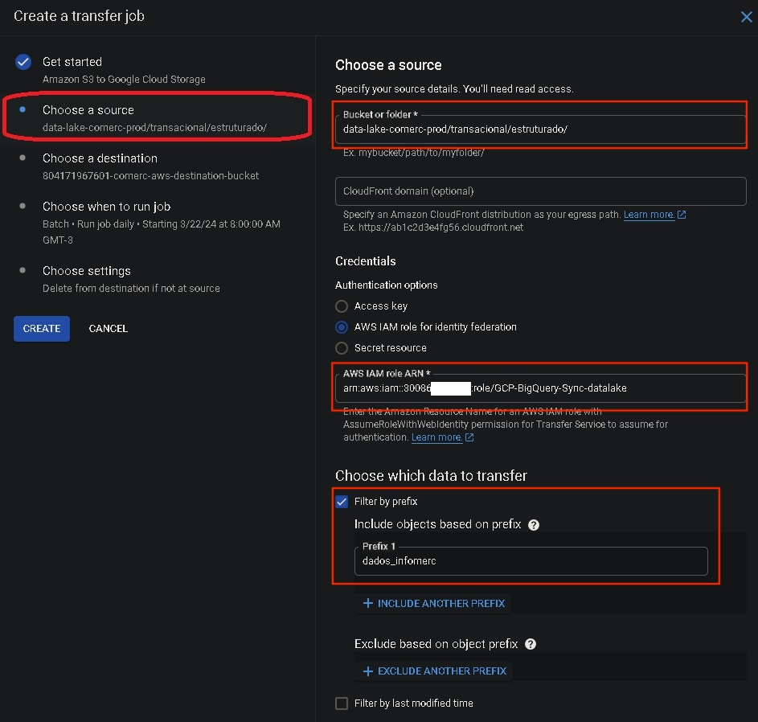
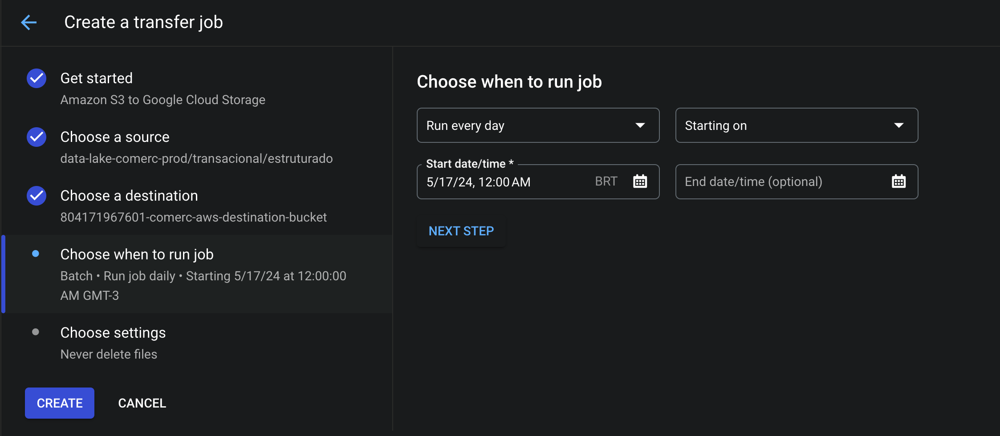
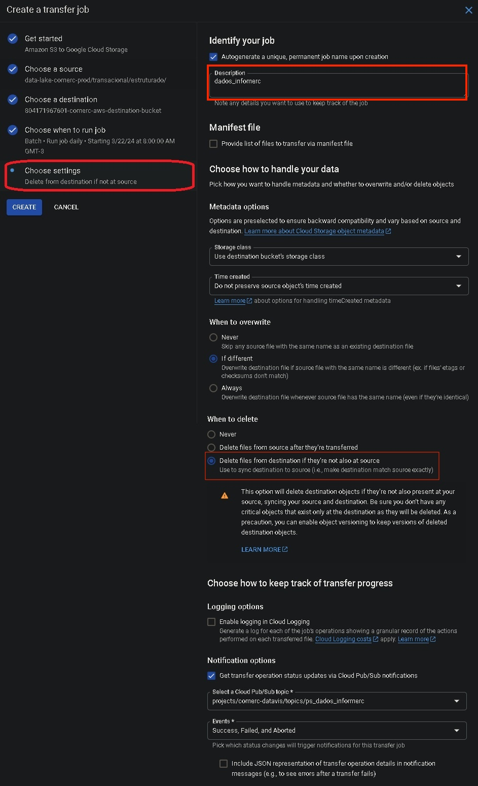
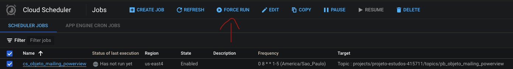

# AWS para GCP + Looker embed

## Visão geral do projeto
O objetivo desse projeto é dividido em três partes: 
1. Executar a transfêrencia de dados da AWS para o ambiente GCP, através de uma pipiline automatizada para a execução desse processo;
2. Utilizar o Looker para realizar um Embedding para incorporar objetos looker, como Dashboards e Explores a uma aplicação da Comerc, permitindo a visualização desses dados transferidos de uma forma visual para seus clientes.
3. Por fim, a chamada da API do looker para retornar esses mesmos dados em um formato JSON

## Arquitetura de solução

## Etapas do desenvolvimento

### Configuração do Google Storage Transfer Service

1.  Passo-a-passo de configuração do tranfer job
No serviço de Storage Transfer, clique em **CREATE TRANSFER JOB**
- Aba Get Started
  - Na opção Source Type, que define de onde os dados virão, selecione **Amazon S3**
  - Em Destination Type, que define para aonde os dados tranferidos serão armazenados, selecione **Google Cloud Storage**
  - Em Scheduling mode, que define o modo de agendamento para a transferência de dados, selecione **Batch** (transferência em lote)
  
- Aba Choose a Source
  - Em **Bucket or folder**, cole o nome exato da bucket do S3 da AWS
  - Em **Authentication options**, selecione **AWS IAM role for identity federation** e cole a ARN da role criada dentro da AWS
  - Marque o checkbox da opção "Filter by prefix", e em "Include objects based on prefix" insira os nomes dos dados de acordo com o propósito de cada job. Isso é importante pois está instruindo o sistema a selecionar e incluir apenas os objetos (arquivos ou dados) cujos nomes começam com esse prefixo específico (nesse caso, o job vai tranferir todos os dados que contém o nome "dados_infomerc" para a bucket do Cloud Storage chamado "dados_infomerc").
    - Adcionar esse prefixo vai resultar em uma maior eficiência de tranferencia, pois estará limitando a transferência apenas aos dados relevantes, o que pode economizar tempo de processamento, custos e principalmente ajuda a manter a organizacão dos dados transferidos. 
  
- Aba Choose a destination
  - Em **Bucket or folder**, clique em BROWSER, e, no painel lateral clique no ícone para criar uma nova bucket. 
  
  - Coloque o nome referente aos dados que serão tranferidos (nesse cado, **dados_infomerc**) e a região como **us-east4** e clique em CREATE. 
  
  - Após criado, selecione a bucket criada e clique em SELECT
- Aba Choose when to run job
  - Nessa parte, vamos configurar o job para rodar todos os dias, começando a partir do dia seguinte, as 8:00 AM, sem especifícar uma data de término 
  
- Aba Choose settings
  - O **Description** de um Job no Storage Transfer atua de maneira semelhante a um nome, facilitando a identificação rápida do propósito do job. Por isso é importante fornecer uma breve descrição para cada Job criado, com base na sua funcionalidade (como na imagem abaixo, esse job vai transferir dados para a bucket **dados_infomerc** dentro da gcp)
    - Podemos ver a importancia do description na [visualizacão dos jobs](#visualizacao-dos-jobs)
  <ul>
    <li>IMPORTANTE: Em "When to delete", foi marcado a opção **Delete files from destination if they're not also at source**, pois, para esse projeto, por uma necessidade do cliente, é necessário, deletar todos os arquivos do lado do GCP para carregar novamente da fonte, para que não haja duplicidade de dados. </li>
    <ul>
      <li>Exemplo: no dia 14, existem dados do dia 1 até o dia 13. Se essa opção não estiver ligada, no dia 15, haverá dados duplicados do dia 1 até o dia 13, mais o arquivo do dia 14. Com essa opção ativada, essa duplicidade será evitada.</li>
    </ul>
  </ul>
  
  
  - Clique em **Create**

2. Agora  Iremos repetir esse processo de criação para criar os seguintes jobs:
    - "dados_infomerc" (Já criado no passo 1)
    - "objeto_dados_energia_gestao_faturas_v2"
    - "objeto_estrutura_atendimento"
    - "objeto_mailing_powerview"
    - "objeto_unidades_atributos"
    - "objeto_vis_orcamento_multiunidades"
    - "permissionamento_usuarios"

3.  Após a criação, podemos visualizar os seguintes jobs criados:

4. Podemos visualizar, no serviço de <a href="https://console.cloud.google.com/storage/">Cloud Storage</a>, todas as buckets criadas através do [passo 2](#criacao-dos-jobs)
   

### Processamento e Armazenamento de Dados

Para configurarmos a pipeline de processamento e armazenamento de dados, vamos realizar o seguinte passo-a-passo:

1.  Configuração do **Cloud Scheduler** e **Pub/Sub**: configure o cloud scheduler para que possa acionar um tópico do Pub/Sub todos os dias, no mesmo horário:
    - No console do GCP, vá para "Cloud Scheduler" e clique em "Create job"
    - Em nome, coloque "cs_dados_infomerc"
    - Em Region, coloque em **us-east4**
    - Em frequency, coloque: **"0 8 * * 1-5"** (está é uma especificacao do cliente para este projeto, para mais informações, acesse a <a href="https://cloud.google.com/scheduler/docs/configuring/cron-job-schedules"> documentação oficial da GCP </a>)
      - todos os dias, de segunda as sexta, as 8 horas da manhã
    - Em timezone, coloque o timezone de São Paulo, Brazil, e clique em CONTINUE
    
      
    
    - Em Target type, escolha Pub/sub
    - Em "Select a Cloud Pub/Sub Topic, Clique em "Create a Topic"
      
      
    
    - No painel lateral direito que abrir, coloque o nome do Pub/Sub referente ao Cloud Schedule (nesse caso será **ps_dados_infomerc**)
    - Clique em Create
    
      
    - Por fim, coloque uma mensagem que será enviado para o Cloud function (a mensagem é obrigatória, mas o seu conteúdo pode ser personalizável).
    Está mensagem irá aparecer no início do log de execução da Cloud Function
      
      

2. Agora, vamos replicar o passo 1 para criar os demais Schedules:

    | Nome do Schedule | Tópico do Pub/Sub |
    | ---------------- | ----------------- |
    | cs_dados_infomerc | ps_dados_informec |
    | cs_objeto_dados_energia_gestao_faturas_v2 | ps_objeto_dados_energia_gestao_faturas_v2 |
    | cs_objeto_estrutura_atendimento | ps_objeto_estrutura_atendimento |
    | cs_objeto_mailing_powerview | ps_objeto_mailing_powerview |
    | cs_objeto_unidades_atributos | ps_objeto_unidades_atributos |
    | cs_objeto_vis_orcamento_multiunidades | ps_objeto_vis_orcamento_multiunidades |
    | cs_permissionamento_usuarios | ps_permissionamento_usuarios |

3. Agora vamos criar as funções na **Cloud Function**, que serão acionadas pelo evento do Pub/Sub. A função irá ler os dados do Cloud Storage, depois irá processar esses dados usando Python e Pandas, e por fim, irá armazenar os dados processados no BigQuery.
    - No console do GCP, vá para "Cloud Functions" clique em "Create function".
    - Em Enviroment, coloque **1st gen**
    - Em Name, coloque **cf_carrega_tabela_dados_infomerc**
    - Em Region, coloque **us-east4**
    - Em Trigger, escolha o Cloud Pub/Sub, e selecione o tópico do pub/sub de acordo com o nome da função e clique em **Save**  
    
  
    - Expanda o "Runtime, build, connections and security settings"
    - Em "Memory allocated", coloque 2 GB (Alocar mais memória permite que a Cloud Function execute essas operações mais rapidamente, reduzindo o tempo total de processamento, e evitando possíveis erros de execução)
    
      
    - Clique em NEXT no final da página
    - Agora, na configuração do código, vamos selecionar o **Python 3.9** como Runtime
    - Em Source code, vamos deixar como Inline Editor, e configurar os seguintes arquivos:
      - No arquivo main.py, vamos colocar [esse código](code/Function/main.py)
      - No arquivo requirements.txt, vamos colocar [esse código](code/Function/requirements.txt)
      - Vamos criar um terceiro arquivo, chamado **schema_tabela.json**, que contem todo o agrupamento lógico que precisamos para configurar os arquivos parquet dentro do bigquery
        - Nesse arquivo, vamos colocar [esse código](code/Function/schema_tabela.json)
      - Em Entre Point, vamos colocar hello_pubsub, que será o nome da função [desse código](code/Function/main.py) que a Cloud Function irá chamar
          
          
  
    - Repita todo o processo criando as 7 functions (DICA: selecione a função, clique em COPY, e mude o nome e o trigger da função):
      - "dados_infomerc"
      - "objeto_dados_energia_gestao_faturas_v2"
      - "objeto_estrutura_atendimento"
      - "objeto_mailing_powerview"
      - "objeto_unidades_atributos"
      - "objeto_vis_orcamento_multiunidades"
      - "permissionamento_usuarios"
          

### Erro de quota

Ao trabalhar com o BigQuery, há uma limitação na frequência de atualizações que você pode fazer nos metadados de uma tabela. Onde, nesse caso, o limite é de 5 operações por 10 segundos por tabela. Para mais informacão, <a href="https://cloud.google.com/bigquery/quotas#standard_tables">Documentação oficial da GCP</a>. 

Da forma que configuramos o Cloud Schedule e Pub Sub, [no passo 1 do tópico anterior](#trigger-config), não importa se sao 1 linha ou 5.000 linhas, isto é considerado 1 insert/update no BigQuery, a ideia é diminuir ao máximo o número desses inserts/updates

Resumidamente, carregamos todos os arquivos .parquet em um dataframe pandas, e carregamos esse dataframe uma única vez no BigQuery.
Lembre-se que o pandas existe um limite de linhas/memória. Para contornar esse problema, voce deve criar "chunks" de dataframes. 
- Exemplo: 20 arquivos .parquet = 1 dataframe; carregue esse dataframe no BigQuery, repita o processo para mais chunks.

### Testando e visualizando dados
Para testar, vamos no cloud Schedule, selecionar um job criado, e clicar em **FORCE RUN**

Após isso, para visualizarmos os dados, navegue até o <a href="https://console.cloud.google.com/bigquery">BigQuery</a> dentro da console do google, e expanda o nome do seu projeto, você verá todos os dataset criados

### Visualização da configuração final

Para poder visualizar a imagem melhor, [clique aqui](./images/architectute/architecture_data.png)

